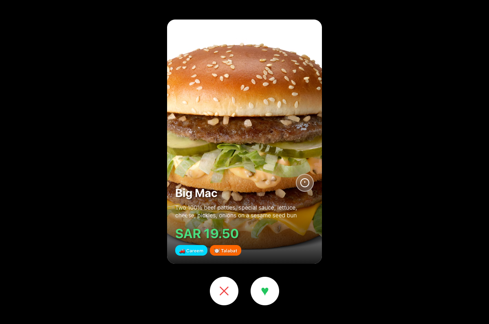
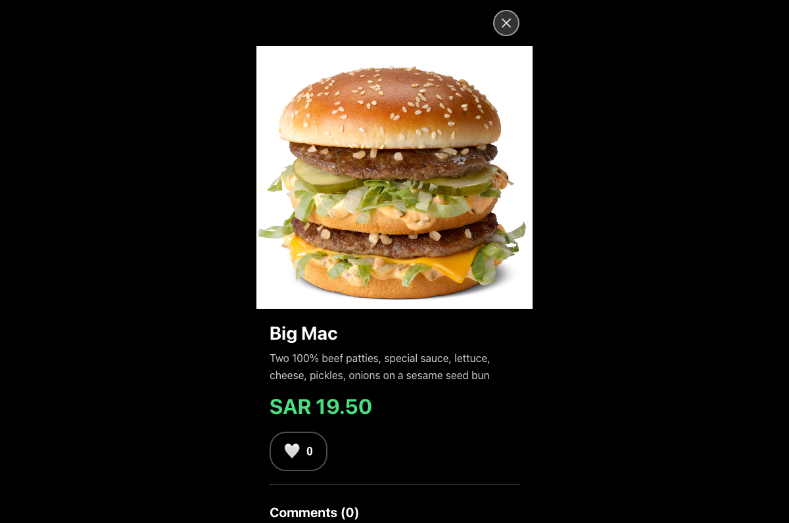
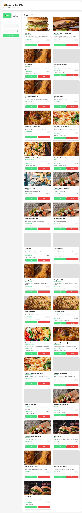

# FoodTinder 🍔❤️

A Tinder-like food discovery app with Instagram-style social features. Swipe through food orders, like and comment on your favorites!

## Screenshots

### Main App

*Main swipe interface - Tinder-like food discovery with delivery app badges*


*Order details view with comments and likes*

### Admin CMS

*Admin panel - Orders management view*


*Admin panel - Restaurants management view*


*Admin panel - Edit form with real-time image preview*

## Features

- ✅ **Swipe Interface**: Vertical scrolling with Tinder-like swipe gestures
- ✅ **Like/Dislike**: Swipe right to like, left to dislike
- ✅ **Instagram-like Social Features**: Like and comment on food orders
- ✅ **Order Details**: Tap info button to see full details, comments, and likes
- ✅ **Personalized Recommendations**: Get restaurant and order recommendations based on your preferences
- ✅ **Mobile-First Design**: Optimized for mobile devices
- ✅ **Simple & Clean UI**: Instagram-inspired minimal design

## Tech Stack

- **Frontend**: React + Vite + Framer Motion
- **Backend**: Express.js + Node.js
- **Data**: In-memory database with sample data

## Getting Started

### Prerequisites

- Node.js (v16 or higher)
- npm

### Installation

1. Install backend dependencies:
```bash
cd server
npm install
```

2. Install frontend dependencies:
```bash
cd ../client
npm install
```

### Running the Application

1. Start the backend server (from `server` directory):
```bash
npm run dev
```
The backend will run on `http://localhost:3001`

2. Start the frontend development server (from `client` directory):
```bash
npm run dev
```
The frontend will run on `http://localhost:3000`

3. Open your browser and navigate to `http://localhost:3000`

## Usage

### Swiping
- **Swipe Right** or click the **♥ button** to like an order
- **Swipe Left** or click the **✕ button** to dislike an order
- You can also drag cards horizontally to swipe

### Viewing Details
- Click the **info button** (ⓘ) on any card to see full details
- View likes and comments
- Add your own comments

### Social Features
- **Like**: Click the heart icon in the detail view
- **Comment**: Type a comment and click "Post"
- See all comments from other users

### Recommendations
- After viewing **10 orders** and liking **at least 2**, a **"🎯 View Recommendations"** button will appear
- Click the button to see personalized restaurant and order recommendations
- Recommendations are based on your swipe history and liked items
- The button appears at the bottom of the screen with a subtle pulse animation
- **Deep Linking**: Click delivery app buttons (Careem, Talabat, Uber Eats) to order directly from recommended items

### Delivery Apps
- Each food order shows which delivery apps it's available on (Careem 🚗, Talabat 🍽️, Uber Eats 🚕)
- Delivery app badges appear on swipe cards
- In recommendations, click the app buttons to deep link into the delivery app
- Supports multiple delivery platforms for maximum availability

## Project Structure

```
foodtinder/
├── client/              # React frontend
│   ├── src/
│   │   ├── components/ # React components
│   │   └── App.jsx     # Main app component
│   └── package.json
├── server/             # Express backend
│   ├── routes/         # API routes
│   ├── data/           # Database logic
│   └── server.js       # Server entry point
├── sample-database.json # Sample restaurant and order data
└── DOCUMENTATION.md    # Full project documentation
```

## API Endpoints

- `GET /api/orders` - Get all food orders
- `GET /api/orders/:id` - Get specific order
- `POST /api/swipes` - Record a swipe (like/dislike)
- `POST /api/likes/orders/:id` - Like/unlike an order
- `GET /api/comments/orders/:id` - Get comments for an order
- `POST /api/comments/orders/:id` - Add a comment
- `GET /api/recommendations` - Get personalized recommendations

## Sample Data

The app comes with 30 food orders from 12 popular restaurants including:
- McDonald's, KFC, Burger King
- Papa John's, Domino's
- Al Baik, Shawarma House
- Sushi Yoshi, Kudo Sushi
- And more!

## Development

The app uses:
- **Vite** for fast frontend development
- **Nodemon** for backend auto-reload
- **Framer Motion** for smooth animations
- **Express** for simple REST API

## Notes

- The app uses varied food images from Unsplash for better immersion
- Each order shows which delivery apps it's available on
- Deep linking opens the delivery app (falls back to web if app not installed)
- All data is stored in-memory (resets on server restart)
- User sessions are simplified (single anonymous user for now)
- **Important**: Restart the server after database updates to load new data

## Future Enhancements

- User authentication
- Persistent database
- Real food images
- Recommendation algorithm improvements
- Restaurant integration
- Order placement

## CMS Admin Panel

Access the admin panel at `http://localhost:3000/admin` to manage orders and restaurants:

### Orders Management
- **View all orders** in a clean grid layout with images
- **Search orders** by name, description, or category
- **Add new orders** with full form
- **Edit orders**: Update name, description, price, restaurant, category, cuisine type, tags, delivery apps, and image URL
- **Delete orders** with confirmation
- **Image preview** while editing - see how the food image looks in real-time

### Restaurants Management
- **View all restaurants** in a grid layout
- **Search restaurants** by name or cuisine type
- **Add new restaurants** with complete details
- **Edit restaurants**: Update name, description, cuisine type, rating, delivery time, delivery fee, address, delivery apps, and image URL
- **Delete restaurants** (prevents deletion if restaurant has orders)
- **Image preview** while editing - see restaurant image in real-time
- **Delivery App Management**: Specify which delivery apps (Careem, Talabat, Uber Eats) have each restaurant

### CMS Features

- **Tab Navigation**: Switch between Orders and Restaurants views
- **Full CRUD Operations**: Create, Read, Update, Delete for both orders and restaurants
- **Image Previews**: Real-time image preview in edit forms
- **Restaurant Assignment**: Change which restaurant an order belongs to
- **Tag Management**: Update tags (comma-separated)
- **Price Updates**: Edit prices easily
- **Delivery Apps**: Manage which delivery apps have each order/restaurant
- **Image URLs**: Update food and restaurant images
- **Real-time Updates**: Changes save to database and reload automatically
- **Simple, desktop-friendly UI** optimized for content management

---

**Status**: ✅ Fully Functional  
**Last Updated**: 2024
